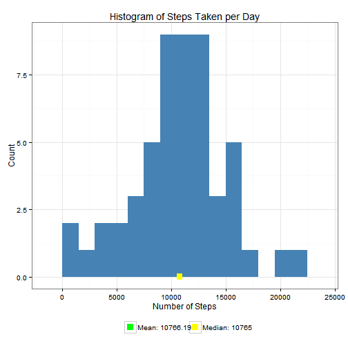
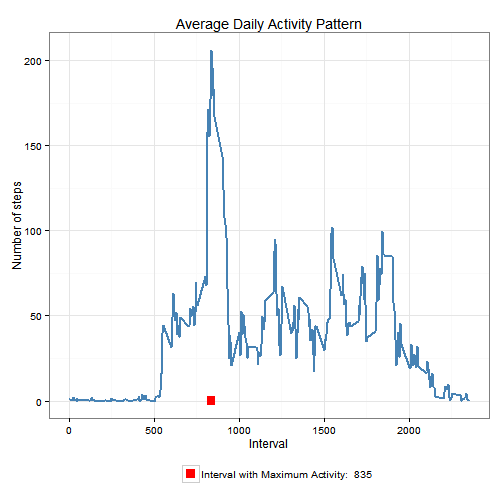
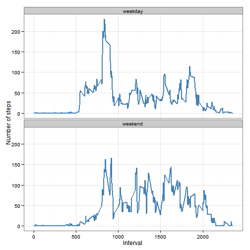

# Reproducible Research: Peer Assessment 1


## Loading and preprocessing the data


```r
require(ggplot2)
```

```
## Loading required package: ggplot2
```

```r
require(downloader)
```

```
## Loading required package: downloader
```

```r

read_data <- function() {
    download("https://d396qusza40orc.cloudfront.net/repdata%2Fdata%2Factivity.zip", 
        "activity.zip", mode = "wb")
    con <- unz("activity.zip", "activity.csv")
    tbl <- read.csv(con, header = T, colClasses = c("numeric", "character", 
        "numeric"))
    tbl$interval <- factor(tbl$interval)
    tbl$date <- as.Date(tbl$date, format = "%Y-%m-%d")
    tbl
}
tbl <- read_data()
```


## What is mean total number of steps taken per day?


```r
calc_steps_per_day <- function(tbl) {
    steps_per_day <- aggregate(steps ~ date, tbl, sum)
    colnames(steps_per_day) <- c("date", "steps")
    steps_per_day
}

plot_steps_per_day <- function(steps_per_day, mean_steps, median_steps) {
    col_labels = c(paste("Mean:", mean_steps), paste("Median:", median_steps))
    cols = c("green", "yellow")
    
    ggplot(steps_per_day, aes(x = steps)) + geom_histogram(fill = "steelblue", 
        binwidth = 1500) + geom_point(aes(x = mean_steps, y = 0, color = "green"), 
        size = 4, shape = 15) + geom_point(aes(x = median_steps, y = 0, color = "yellow"), 
        size = 4, shape = 15) + scale_color_manual(name = element_blank(), labels = col_labels, 
        values = cols) + labs(title = "Histogram of Steps Taken per Day", x = "Number of Steps", 
        y = "Count") + theme_bw() + theme(legend.position = "bottom")
}

steps_per_day <- calc_steps_per_day(tbl)
mean_steps = round(mean(steps_per_day$steps), 2)
median_steps = round(median(steps_per_day$steps), 2)
plot_steps_per_day(steps_per_day, mean_steps, median_steps)
```

 


## What is the average daily activity pattern?


```r
calc_steps_per_interval <- function(tbl) {
    steps_pi <- aggregate(tbl$steps, by = list(interval = tbl$interval), FUN = mean, 
        na.rm = T)
    # convert to integers for plotting
    steps_pi$interval <- as.integer(levels(steps_pi$interval)[steps_pi$interval])
    colnames(steps_pi) <- c("interval", "steps")
    steps_pi
}

plot_activity_pattern <- function(steps_per_interval, max_step_interval) {
    col_labels = c(paste("Interval with Maximum Activity: ", max_step_interval))
    cols = c("red")
    
    ggplot(steps_per_interval, aes(x = interval, y = steps)) + geom_line(color = "steelblue", 
        size = 1) + geom_point(aes(x = max_step_interval, y = 0, color = "red"), 
        size = 4, shape = 15) + scale_color_manual(name = element_blank(), labels = col_labels, 
        values = cols) + labs(title = "Average Daily Activity Pattern", x = "Interval", 
        y = "Number of steps") + theme_bw() + theme(legend.position = "bottom")
}

steps_per_interval <- calc_steps_per_interval(tbl)
max_step_interval <- steps_per_interval[which.max(steps_per_interval$steps), 
    ]$interval

plot_activity_pattern(steps_per_interval, max_step_interval)
```

 


## Imputing missing values


```r
impute_means <- function(tbl, defaults) {
    na_indices <- which(is.na(tbl$steps))
    defaults <- steps_per_interval
    na_replacements <- unlist(lapply(na_indices, FUN = function(idx) {
        interval = tbl[idx, ]$interval
        defaults[defaults$interval == interval, ]$steps
    }))
    imp_steps <- tbl$steps
    imp_steps[na_indices] <- na_replacements
    imp_steps
}
complete_tbl <- data.frame(steps = impute_means(tbl, steps_per_interval), date = tbl$date, 
    interval = tbl$interval)
```


## Are there differences in activity patterns between weekdays and weekends?


```r
calc_day_of_week_data <- function(tbl) {
    tbl$weekday <- as.factor(weekdays(tbl$date))
    weekend_data <- subset(tbl, weekday %in% c("Saturday", "Sunday"))
    weekday_data <- subset(tbl, !weekday %in% c("Saturday", "Sunday"))
    
    weekend_spi <- calc_steps_per_interval(weekend_data)
    weekday_spi <- calc_steps_per_interval(weekday_data)
    
    weekend_spi$dayofweek <- rep("weekend", nrow(weekend_spi))
    weekday_spi$dayofweek <- rep("weekday", nrow(weekday_spi))
    
    day_of_week_data <- rbind(weekend_spi, weekday_spi)
    day_of_week_data$dayofweek <- as.factor(day_of_week_data$dayofweek)
    day_of_week_data
}
plot_day_of_week_comparison <- function(dow_data) {
    ggplot(dow_data, aes(x = interval, y = steps)) + geom_line(color = "steelblue", 
        size = 1) + facet_wrap(~dayofweek, nrow = 2, ncol = 1) + labs(x = "Interval", 
        y = "Number of steps") + theme_bw()
}
day_of_week_data <- calc_day_of_week_data(complete_tbl)
plot_day_of_week_comparison(day_of_week_data)
```

 

